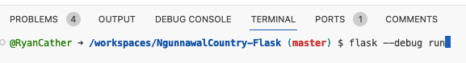

## Run the Project

Once the project has fully opened, run the project by typing the following into the terminal:

```
flask --debug run
```



Once completed, you'll be prompted to open the project in a new browser window.
